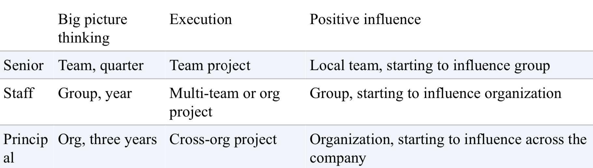
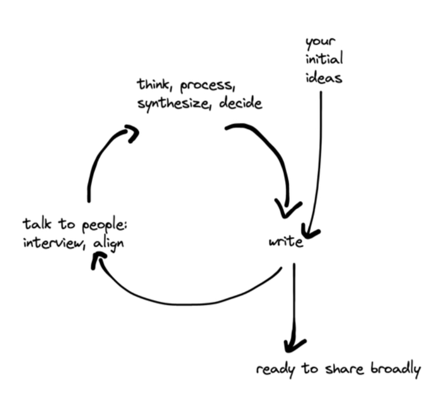
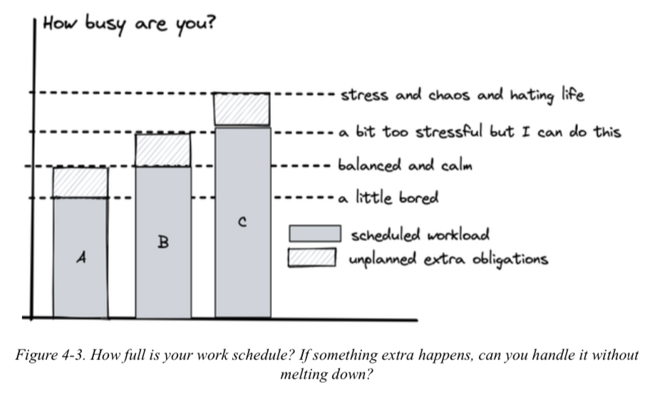

**Author:** Tanya Reilly

**Genre:** Career, Philosophy, Technology

**Rating:** Lifechanging

## 🚀 The Book in 3 Sentences

1. The book is a practical guide on what it means to be a staff engineer — how to think big picture, execute effectively and be a positive influence in your organisation
2. It teaches you how to navigate the terrain of your company, create technical vision and strategy, manage your finite time and lead big projects without being a manager
3. Through real world advice and frameworks, it gives you the tools to understand your role, find high impact work and grow as a technical leader

## 🎨 Impressions

The book feels like a conversation with a mentor who has been through it all. It is very practical and grounded in reality — no fluff, just honest advice about what it takes to operate at staff level. The three pillars framework (big picture thinking, execution, positive influence) gave me a lens to evaluate where I spend my time. The chapters on time management and choosing projects hit close to home.

### How I Discovered It

It kept coming up in conversations and recommendations around career growth on the IC track. Picked it up when I was thinking about what staff engineering actually looks like day to day.

### Who Should Read It?

Any senior engineer who is thinking about or already on the staff track. Also useful for managers who want to understand what their staff engineers should be doing.

## ☘️ How the Book Changed Me

- I am more intentional about where I spend my time and which projects I take on
- I will try to build the three maps (locator, topographical, treasure) for any new team or project I join
- I think about my work in terms of the five personal indexes — energy, happiness, credibility, social capital and skills
- I feel more confident saying no to projects that don't align with my growth or the organisation's priorities
- I will focus on creating the work rather than waiting for it to be assigned to me

## ✍️ Quotes

> Just because your brain had an idea or concept doesn't make it the best idea. Listen to others and think on the feedback.

> Don't waste the brief period where it's easy to not know!

> They're so competent that it feels like you're building skills by bathing in their aura.

<strong>📒 Summary + Notes</strong>

### Introduction

The tech track can vary from company to company, but most common progression if an individual wants to stay in tech instead of a manager path is

Junior Engineer → Mid level Engineer → Senior Engineer → Staff Engineer → Senior Staff Engineer → Principal Engineer → Distinguished Engineer/ Senior Principal

Why these titles are necessary, it's because this helps an individual and an organisation understand that the individual is progressing and also communicate this to outside world. This also indicates more authority on subject matters to an individual with seniority.

What an engineer usually would do according to the author is divide his time across three pillars, of course the foundation of all the pillars being **Tech and Knowledge Experience**

- Big picture thinking
- Execution
- Positive Influence

The skills needed to strengthen the three pillars are

- Communication and leadership
- Navigating complexity
- Introspecting your work
- Mentorship, sponsorship and delegation
- Framing a problem and telling a story to make other people care about it
- Acting like a leader when you feel like it or not

---

### Chapter 1. What would you say you do here?

**What is a staff engineer?**
We need engineers who can see big picture, often decisions can be made that benefits a local team and tries to maximise on it, author describes it as Local maxima, and which can be detrimental in long run or provide very little value. Good decision needs context

**Why do we need engineer that can function across teams?** Chapter describes about [inverse Conway principle](https://www.shortform.com/blog/inverse-conway-maneuver), to understand this one should know Conway law, which is the software architecture component mimics the team structure. Engineers who can see broader picture can help with inverse Conway maneuver

**Why do we need engineers who are a good influence?** Because these engineer set example and standards for an organisation, and are role models in their domains.

**What's my job?**
This boils down to few fundamentals

- You're not a manager, but you are a leader
- You're in a technical role - need to have solid foundation of technical skills
- You aim to be autonomous - one of the thing I liked from this section was for a staff engineer where do you find the high impact and value work, "you create it"
- You set technical direction - Ensure that the directions you set, encompass various teams and are well documented
- You communicate often and well

**Understanding your own role**
There are a lot of questions one can ask to understand their role

- **Where in organisation do you sit**
Do you report high to a direction/vp or report low to a manager, pros and cons accordingly
- **What is your scope**
Its important to define your scope at start as scope to broad or narrow can be bad
    - Broad scope - Lack of impact, becoming bottleneck, decision fatigue, missing relationships
    - Narrow scope - Lack of impact, opportunity cost, overshadowing other engineer, over engineering
- **What do you enjoy doing**
    - Do you approach problem depth-first or breadth-first? You need to define it for yourself.
    - Which four discipline you are more aligned towards? Core technical skills, product, project or people management. With more seniority you are expected to shift easily between these roles
    - How much do you want to code?
    - How's your delayed gratification, since the work you do might take time to get a feedback or see effects
    - Are you keeping a foot on manager track?
    - Do you fit the following archetypes? Tech leads, Architects, Solvers, Right hands
- **What's your current mission**
    - What's important, the work you do have to important
    - What needs you, some of the project already has senior people working on it, do don't butt in, find where you are needed

**Aligning on your scope and mission** A nice mention in the book is the write out the understanding of your job and share it with manager, refer to sample in the book

---

### Chapter 2. Three Maps

This chapter suggests any staff engineer needs to define three maps

- A locator map - to figure out your place in the wider organisation and company
- A topograpical map - to navigate the terrain, if you know you're way around the company some things might be easier to tackle and locate
- A treasure map - Can be considered as stops across our journey. Can be vision strategy, making decisions and the plan to reach those goals

Clear the fog of war — These maps are somewhat there in an organisation but there exists a fog/ lack of clarity on these topics. As a staff engineer if you can clear the fog for your team, it sets them up for success

- Make sure team understands their purpose in organisation, who customer are and how their work impacts others
- Highlight frictions and gaps between teams and show the paths across organisations, enable a team member to form connection across org and get their work done
- Make sure eveyone knows exactly what they're trying to acheive

Knowing things the skills — Pay attention to all the information at company level from slack chat, the announcements, all hands, etc to make your team aware and save from potential disruptions

Knowing things the opportunities - find way to build information from knowing things and turn it into opportunities

**The locator map: Getting some perspective**

- **Losing perspective** there are four kind of risk that comes with knowing more and getting deep into a team knowledge
    - Making poor priority decisions - when everyone around cares about same set of things it's easy to mangnify the importance of these things.
    - Losing empathy - undermining other teams work
    - Tuning out background noise - We get used to some of the problems over time that we often ignore how tedious it can be for someone new
    - Forgetting what work is for - Working in silo means loosing sight of what's going elsewhere in company and loosing sight of the big picture
- **Seeing bigger** some of the points to help out to see things from broad perspective are
    - Taking an outsider view - Either you can get someone to evaulate your systems or you can force yourself to think like an outsider to see bigger picture following points can help to see things as an outsider
        - Escaping echo chamber - seek feedback from other team however harsh it is and process it into something productive to bring change, a group of staff engineers in an org can bring such discussion to table
        - What's actually important - Just go to trivial questions like what is necessary for companies survival, getting paid, etc and work up from there to figure out most important topics
        - What do your customers care about - favorite quote from this section was, "Nines don't matter when users are not happy". We need to measure success from users pov
        - Have our problems been solved before - [boringtechnology.club](http://boringtechnology.club), don't reinvent the wheel

**The topographical map: Navigating the terrain**

This section tells us how to deal with the boundaries and obstacles we might face while executing a project after locating the opportunities

- Rough Terrain
Difficulties one would face without a detailed map
    - Your good ideas may not get traction - Being right about a change is half the battle you need to convince other people and get them onboard as well
    - You won't find about the difficult parts until you get there - sometimes you'd pick on problem that other people might've tried before and failed, to get around this first tackle on the most difficult part to convince other that this can work
    - Everything takes longer - Unless you know how org works, all things you do might take longer
- **Understanding the org**
If you understand the org well you'll be better prepared to tackle the problems mentioned above. Some questions to ask to get the answers to this is
    - What's the culture - The Westrum model classifies the org in three classes, pathological, bureaucratic and generative, to figure out where do you stand you can ask few questions
        - Secret or open - how does the information flow in the org
        - Oral or written - how are agreements made in the org
        - Top-down or bottom-up - where do the initiatives come from
        - Fast change or deliberate change - pace of development
        - Back channels or front door - how can you communicate the proposal and get other team to work on it, through a TPM or an engineer you already know
        - Allocated or available - how much time does everyone have
        - Liquid vs crystallised - where does power status and reputation comes from, how do you become trusted
    - Noticing points of interest
        - Chasms - identify the gaps in the teams/people and be weary of those in the project
        - Fortresses - some of the team/individual might straight up reject your ideas
        - Disputed territory - When two or more team work on a project to be successful, their projects can fall into chaos if they don't have the same clear view of where they're trying to get
        - Uncrossable deserts - it is good to know if you're working on something un winnable, something that has failed before so that you are more careful
        - Paved roads, shortcuts and long ways around - some time just asking can give you a shortcut to achieve a task which otherwise would have taken a long time
    - What point of interest are on your map - This sections tells us how to detail our own topographical map
        - How are decisions made - you need to sell your idea to many people and not just be technically correct with your proposal
        - Where is the room - You need to identify who are the decision makers, where these discussions happen and be part of it
        - Ask to join in - You just can't straight up go to these people and ask them to invite you, you need to prove that the reason you are there is to create an impact for the organisation. Make sure you contribute in a way you are invited back
        - Shadow org chart - Many of the leaders rely on people who have been in the organisation for a long time. Before going to these decision meetings, getting a buy in from these people make some friends and this will be easy to sell your idea
    - Keeping topographic map up to date
        - Automated announcements and channels
        - Walking the floor -  run retrospectives, manage incidents, pairing on changes
        - Lurking - check other peoples calendar, what's coming what they have planned, read slack channels of other teams if you're invested in that
        - Making time for reading - Go through RFC's, read PRD's and other proposals
        - Checking in with your leadership - check with your sponsors any behind scene things etc
        - Talking with people - Peer one on ones, skip one on ones, chatting over coffee to know what they are up to
    - If the terrain is difficult to navigate be the bridge - if it's difficult to navigate the company terrain, try to be a bridge to connect two different topics/ domains you come across and help those teams

**The treasure map: remind me where we're going**

Have this map to turn short term goals into delivering the future goals you have, make sure you steer in the right direction which everyone agreed and alter course based on current feedback and policies

- It'll be harder to keep everyone going in the same direction There are always so many hurdles along the way, changes in teams restructures, someone leaving and also the problems which were discussed in previous section. The path to destination would not always be straightforward but you have to make sure everyone is still aligned in working towards the same direction despite all the variable changes
- You don't finish big things
Only focusing on short term goals week over week, says that you don't have a perspective of what you are working towards, you should change this
- Cruft and wasted effort
Without target on treasure map, technical decisions becomes difficult since you don't have a clear vision of how the future states would be
- Competing initiatives
On some big initiatives there can be multiple proposals on how to solve the problem, you should always look at desired future state and act based on that. The competing ideas can generate some friction
- Engineers aren't growing
Having a clear vision on long term goals and not keeping focus only on the short term goals keeps everyone aligned and helps them grow in their career. There should be a good narrative to what one does
- Taking a longer view
Timely retrospective can help keep everyone aligned towards our goals since it's always difficult to keep everyone headed in same direction. Following questions can help
    - Why are we doing whatever we're doing?
    - Fact-finding mission  - Take a look from outsider perspective and look for vagueness
    - Sharing map with other people
- If treasure map is unclear, it might be time to draw your own
Chapter three details this point, how to create a mission and vision in case you can't find one
- Your own personal ship's log
Since feedback for you would be longer cycles, looking back weeks month and year, you should have a narrative of what you've achieved so far

---

### Chapter 3. Creating the big Picture?

When paths undefined and confusing sometimes we need to get a crew together and create the missing map

- The approach You need to figure out what you need to do
- The writing You need to put down the foundation or define the treasure map for the work, move to ready to review state
- The launch You need to get a buy in from everyone to start working on the new treasure map

**What's a vision? What's a Strategy?**

Some of the problem statements can be in the following narrative

- Build onto an existing component or new one?
- Whether you have to use some inflexible legacy system
- What volume of request you should plan to support in three years
- How to work with shared code that's built on deprecated libraries
- Build new functionality as reusable component or part of a specific product?
- Use existing data models or create new one?
- What should be the domain language?
- Where is the data store?
- Boring technology or go for cutting edge tech?
- Use robust legacy system or use the new system that is still not ready yet

You can take into consideration the following points  while defining the strategy and vision

- What's a technical vision
Technical vision is how you would describe your future for your domain and ideal state. While creating a technical vision you might inherit from a larger scope of your org or influence the smaller technical visions.
Vision creates a shared reality at whatever scope you're working. A technical vision should be empowering for everyone else and not restricting it should create opportunities. It doesn't set out to make a decision but, it should also remove conflict or ambiguity and make it easier for everyone to choose their own path while being confident they'll end up in right place
    - Resource for writing technical vision
    A technical vision should be **simplifying**, **intentional**, **consolidated**, **inspirational** and **memorable**
    - What goes in a technical vision?
    What are some questions you might ask initially to write a technical vision
        - What document already exists - Are there other vision or strategies that are outside the one you are creating? Ideally you should inherit them if they encompass your vision
        - What needs to change - Looking at what's difficult right now might give you idea what you want to make easy in the future
        - Whats great as it is - Vision should include greatness that you already have. It shows how your strength can help realise the vision
        - What would be a good investment - Identify which architectural characteristic you want to improve on that you didn't invest in past and want to improve in the future
        - What's ambitious - It is good to know what is achievable and what can be stretch goals for you
        - Whats reasonable - Some changes are not possible and will be too small to justify the time and money they'll take, make sure you assess this before hand
        - No really what's important - Reiterate on the most important things in terms of time value invested and impact created by it.
        - What will future-us wish that present-us had done - Have a conversation with self about what your future self would want
- What's a technical strategy?
Vision is a dream and strategy is how do you realise this dream. You should be mindful that the technical strategy also aligns with the company strategy and is mindful of product and business strategy as well
    - Resource for writing technical strategy
    Book good strategy bad strategy is a great read. The slack channel on rands #books-good-strategy-bad-strategy discusses this book. Technology strategy pattern: Architecture as strategy gives you how to think like a CTO
    - What goes in a technical strategy
    According to the book mentioned above there are three steps to decide the contents
        - The diagnosis - Where you are now, what's happening and what are you trying to achieve. These questions should bring clarity to you, remove distraction and describe through lens to look at the problem you are trying to solve
        - Guiding policy - This is the overall approach that you are going to employ to solve the problem in diagnosis step
        - Coherent actions - Once you have the previous two things you can pen down the actions you are going to take and the ones you are going to not. Can be considered as a finalising one solution from multiple proposed solutions
    - Do we need one of these?
    You should take some time to step back and re evaluate if the entire vision and strategy is not an overkill or not.

**The approach: what are we going to do?**

You need a ton of preparation, and the most difficult task, if it involves a lot of team members, is finding common ground. Making a document is one percent inspiration and realizing it is 99 percent perspiration. Some things to keep in mind that will help you succeed in the vision or strategy are:

- Making peace with the idea that the document will be boring and not flashy
- Finding other people who are potentially solving the same problem
- Choosing a small core group to work with
- Finding high-level sponsors to advocate for the work you are doing
- Finding more stakeholders who will help you in your journey (senior IC's, shadow org, etc.)
- Agreeing on exactly what you're creating
- Choosing the scope of work
- Reflecting on whether your work is actually achievable or not

These points will help nudge your document in the right direction that will be beneficial for the company.

- Brace for boring ideas
Not everything is going to be flashy, fancy tech. Boring tech works, and that is going to be the solution most of the time. Even when there are a lot of good ideas and plenty of things to do, the gap is usually getting everyone to agree on what things to do.
- Is there an existing journey?
You need to go in with a mindset that other people's ideas are not a competition, and they're not a threat. If there is someone else solving the same problem, then you can join in on the work. You can co-lead it. You should promote people to lead the project and act as a support to them. If they are not going in the direction you want, it can be a good time to practice an outsider view and see why they are going in that direction, maybe it is for the better? "Just because something comes out of your brain doesn't make it the best idea"
- Getting a sponsor
Vision or strategy can being without a sponsorship but you need a sponsor when you want to get it to reality. Maximise the chance of sponsorship by bringing something they want. People tend to respond better to positive stories about what you can unlock rather than the warning and bad things that can happen. Sponsorship also adds hierarchy to the group, giving a veto.
- Choosing your crew
You can either work as a group or individual on the vision and strategy document you are creating. Try to find out if you are going to work alone you need to not be distracted by side quest, or have an accountability system so you do not get side tracked. If you are creating document as a group you can set some ground rules to work on. Agree on time that you'll work on it and group you team based on this. Once you have a team, be prepared to let them work, let them have ideas, drive project forward and talk about it without redirecting questions to you.
- Allies and skeptics
You'll have supporters and people who oppose the initiatives, try to understand both the thought process and see why people want it and why do they not want it
- What are we creating? What's our scope?
Be mindful of the changes that impacts other teams that you are introducing. You need to have their consensus to set you up for success. Be realistic, think about what is possible. Be aligned with the business direction, sometimes one change in business direction can invalidate your entire idea. Along with being clear about the scope be clear about the document you are going to create, the level of abstraction you want, the technicality, and also remember the intended audience for the document
- Is this achievable (by you?)
Your journey will take you through difficult terrains, convincing many teams, getting everyone aligned and then delivering what's promised, keeping a check on technical feasibility, gatekeeping things and keeping everyone motivated. Consider all the constraints up front.
- Read to commit to doing this?
Do a retrospection of all the questions before you commit. A checklist can be
    - [ ]  We need this
    - [ ]  I know the solution will be boring/ obvious
    - [ ]  There isn't an existing effort
    - [ ]  There is org support
    - [ ]  We agree on what we're doing
    - [ ]  It's solvable (by me)
    - [ ]  I'm not lying to myself on any of the above

    Final question to yourself would be, are you ready to commit to the work and start working on it out loud?

**The writing: actually making the document**

With a solid foundation and all questions answered, follow the loop to start working on the document with the team. Be wary of the extra information and evaluate the returns of this information on the loop

Add some self imposed deadlines for each iteration

- Writing something to start with
As you start planning the vision and strategy, you will have a lot of ideas, write it down, so that you have something to discuss with the team. An unconventional first approach can be all the team member write their first version of the document to get unbiased opinions. Be careful as some participants might get emotionally attached to their version it is necessary to not deviate from the primary goal.
- Interviewing people
Once the team has a first draft, you should consider getting views of people outside the team. In this exercise put the preconceptions aside and talk to lot of people. Keep the discussion open ended and get their narrative for the document, what we should've asked them, any important things missing
- Thinking time
Strategy would more or less be high level, so you will need a lot of time to carefully think of the consequence mentally. It is also a good time to check on your own motivation, look out how you are framing the problem statement, whether it is already in a tone that describe the solution.
- Making decision
Decisions constrain the possibilities and make it possible to make progress. Lack of decision is in itself a decision to keep both the status quo and the uncertainty that surrounds it. For tough decisions a tactic can be to take sense of the group a rough consensus rather than making everyone agree perfectly on the decision.
- Staying aligned
You should constantly share updates with the team. Create a summary rather than sending raw text and get their feedback to make sure everyone is on same page. Get feedback from sponsors and major stakeholders as well. Share information before hand to lay a foundation, so when the time to make decision is near, there is a consensus of opinion and it will make it easy to move ahead. "Don't call for vote unless you know you have a vote". Aligning doesn't mean convincing people of things, it's a mutual agreement. You'll have to compromise sometime.

**The launch: making it real**

This section describes how to make the document official

- The final draft
You have to think about how to make your document easily readable, so that people can understand it in one go and take away all the information that you want. One approach is to narrate the document as story using "persona's" describing people affected by the document. Another approach is to describe it as real life scenario that difficult, expensive for business and show how that will change. Be very concrete. Take time to understand what will work for your audience
- Making it official
Reach out to sponsor, stakeholder and if you're aligned see if they are willing to send an email, add their name to document as endorsement, refer it for quarter meetings, invite you to present the plan, just a public gesture of acceptance. Once the document is complete, remove the ability to edit/comment  document, and ask for feedback async so document is not polluted
- What story are you telling?
Make sure you can summarise the document into shorter version so that people don't have to go through the entire document. One liners can be a catchy way to get people engaged. If you can convince people about the journey you are describing, it will more likely to be successful. You want a story that is comprehensible, relatable and comfortable.
- Keeping it fresh
You'll have to adapt over time once the document is complete. Don't stop thinking just after making it official, with new information things will change

---

### Chapter 4. Finite time

You have finite time no matter what so choose your battles wisely. You are responsible for your own personal goals and career along with company goals.

**Doing all the things**

Staff engineer are in demand, and every new project would like to get a feedback from them because of their experience. You'll be pulled in all directions so it's your responsibility to look out for projects you want to do. The projects that with help your growth, your reputation and work life balance. A small exercise could be to rate a project based on 5 personal indexes

- Energy
- Happiness
- Credibility
- Social capital
- Skills

**Time**

Staff engineers work is to not always to create technical documents but to also lead and execute projects. Everything that you commit to has an opportunity cost.

- Finite time
It is a good idea to put down everything on the calendar, not only just the meetings, but time to code, review code, write documents, etc. This would give you a clear picture about how much free time you have and what you can do in that free time.
- How busy do you like to be?
Leadership roles tend to be unpredictable in terms of load. So think about how volatile your incoming workload might be, what you're filling your schedule with and how much buffer you want to build in.

- projectqueue.pop()
You should be able to stack rank all the project in order of priority. Usually the top priority would be something that you can do very well in that case you can let someone else take over give them a chance to grow and work on something down the queue. There's always going to be a balance between choosing the strictly most important next thing, and making sure you're choosing work that's right for you. If you look for ways that your projects can keep you healthy and happy and keep growing your skills, you're going to do a better work and it will be easier for company to retain you

**Resource constraints**

You have to make peace with walking past something that is broken or suboptimal and taking no actions. It's a resource allocation problem.

- Sim-You
5 personal index indicator, following shows what can increase or decrease it.
    - Energy
    In theory if you have a free hour, you can choose to spend it in a way you want. In practice it will depend on energy you have. You must have this much energy to be able to start this task. Understand what kind of work are energy expensive for you and what kind with have you left with energy at end of the day. It is also affected by factors outside work
    - Happiness
    Not all of your happiness will or should come from your work, you may even stick with work you dislike because it's a step towards something you want and you're optimising for the future happiness. Since work consumes a big portion of our life we should always seek what makes us happy at work an achieve it.
    - Credibility
    Don't just write great code be an exemplar by writing great tests, monitoring and documentation too. Don't just make a decision, spell out the risk and explain trade offs. Technical judgement also means being very wary about stating absolute truths or claiming something is universally true. You should build credibility beyond technical skills too.
    - Social capital
    It reflects whether others want to help you do the things you want to. Social capital is a mix of trust, friendship and just that feeling of owing someone a gator, or believing they'll remember that they owe you one. It is built over time.
    - Skills
    You'll build skills in three main ways
        - You'll deliberately set out to learn something
        - You'll work closely with an expert
        - You'll learn by doing - most common way
- The equation: E + 2H
There is no strict equation it is alway about the trade offs. Always look out for opportunities that have outsize positive impact.

**Where do projects come from?**

When you have higher level of autonomy you get to make decisions and steer the direction and discussion of many projects that you'll be part of.

- Externally initiated projects
Once you start gaining autonomy, other teams might reach out to you to collaborate on a project. Sometimes your manager will ask you to work on project that you're not interested it. You can of course say no, but it comes at cost of social capital. Some of the ways are
    - Invitation to join a project - Some other team may ask you to collaborate on a project
    - Fire alarms - something that is urgent and needs all experienced hands on deck
    - Request for consultation - Can be in form of reviewing all hands talk, request peer feedback
    - Request for mentoring - Someone may ask you to mentor them
- Your own initiatives
Finding your own project come in the form of asking for opportunity, having ideas, noticing problem or taking things that just have to happen
    - Asking for the job - you can ask to jump in on work that is interesting and creates impact for you
    - Big ideas - These are some of the opportunities that you identify
    - Making the organisation better - Look at your organisation with an outsiders eye and see what can be better
    - Tidying up - This can be small things or improvements that you want to make and has been on back of your mind. Be careful that this does not consume a lot of time and derail you from longer term projects
    - Being the engineer of last resort - Taking on work that you don't want to do but needs to be done. Some team might need help and here is where you come in. This can earn a lot of goodwill in return

**Which project should you take?**

Between the projects you create and are sent to you, you'll get a lot of projects to work on, you can't do everything so you need to decide which ones to work on

- Project shapes
Some of the project shapes are
    - Main project - It takes majority of your time, around 75%
    - Part-time/ Fractional project - Could be a small project on side along with the main project for couple of hours a week.
    - Side quest - Could be fixing something to unblock others, etc. Not the main project
    - Diversion - These are usually projects where you drop everything to address more serious matters. Could be an incident for example
    - Just meddling - This could be, you see certain project going in a dangerous direction and you just nudge them in the right direction. Make sure to not get involved long enough
- A bin packing problem
Mostly deals with how to utilise your free time, if a block opens up on your calendar what project do you work on what do you prioritise?
- Questions to ask yourself about projects
    - Time: What's the ongoing time commitment? - Be clear with what you're adding to your schedule and realistic with how much time you can spend
    - Time: Are there exit criteria? - It is important if you're not sure if you should be doing this
    - Energy: How many things are you doing already? - You can't take more than your capacity. Look at the "How busy you are" graph and jump in accordingly
    - Energy: Does this kind of work give or take energy? - Is this project something that excites you or have to do
    - Energy: Are you snacking? - If you are low on energy some low effort low impact task can be good to pick till you are well rested
    - Happiness: Do you like this work?
    - Happiness: Are you getting nerd-sniped? - You'll always be tempted to work on a new shiny solution, which would make you happy. But at the same time ask how important that is.
    - Credibility: Does this project use your technical skills? - If you are operating at a high level, you might want to get into weeds occasionally
    - Credibility: Does this project show your leadership skills?
    - Social capital: Is this kind of work that your company and your manager expects at your level? - As simple as are you doing your job
    - Social capital: Will this work be respected? - This will build goodwill with others
    - Social capital: Are you squandering the capital you've built? - Don't spend all the time on fixing low impact problems
    - Skills: Will this project teach you something you want to learn? - Look out for yourself and align your personal career growth with projects
    - Skills: Will the people around you raise your game? - "They're so competent that it feels like you're building skills by bathing in their aura"
- What if it's the wrong project?
After answering all the questions above you might have a good idea if the project is right or wrong for you, what do you do in case it's wrong?
    - Do it anyway? - Could be a very vital project for the company, that does not align with project you want to work on. In short term might be the right decision but you need to have an exit criteria to make it sustainable
    - Compensate for the project - If some of the aspects of project are not enticing, try to compensate for it. Could be you don't have energy and happiness in doing the project, you can get it from snacking?
    - Let others lead - A project might not be a good fit for you, but can be an excelled opportunity for others? Think about others, lend them a hand and let them lead it.
    - Resize the project - If project doesn't work you in current shape, try reshaping it into something that works for you?
    - Just don't do it - If no aspects mentioned above work for you, just say no. Might be very difficult but you are doing a favour to yourself in long term

**Conclusion: defend your time**

You won't succeed unless you can defend your time. The number of demands on it will increase and the number of available hours will stay the same. So be deliberate about what you choose to do and make sure that whatever you want to get done is getting priority and getting done well.

---

### Chapter 5. Leading Big Projects

With the experience you have as a staff engineer you can make things tractable. It's normal to feel overwhelmed by big project, that's why it needs someone like you.

**The life of a project**

Power that makes a great project lead is rarely genius: it's experience. Most of the time a problem is difficult because you are dealing with ambiguity: unclear direction, messy complicated humans; or legacy systems whose behaviour you don't understand and can't predict.

**The start of a project**

Start of project can be chaotic. Since you are technical lead you are sort of in charge, the people don't report to you but you are incharge.

- If you're feeling overwhelmed
It's normal to feel overwhelmed. It takes time and energy to build mental maps. The feeling of discomfort is called learning. Imposter syndrome can also kick in, these feelings might be a signal that you're low on resource described in last chapter. Following steps can help you make project a little less overwhelming
    - Create an anchor for yourself - Create a document just for yourself, which can act as a second brain. Throw in all the questions, assumptions, reminders, to-dos.
    - Talk to your project sponsor - Understand what the sponsor wants you to do. Set up a meeting with them, write down your expectations and ask if this is the what they expect as well.
    - Decide who gets your uncertainty - Find a mentor or a peer who you can be open and unsure with.
    - Give yourself a win - Don't waste the brief period where it's easy to not know!
    - Start building context - Build context, read the code. Talk to people what ever works for you. Don't work in silos and believe you can do it.
- Building context
You'll need to build all maps discussed in chapter two. Some points that can help you set context for your self and everyone else:
    - Goals - The why it going to be a motivator and guide throughout the project.
    - Customer needs - Talk to your customers and listen to what they need. It is not easy knowing what customers need.
    - Success metrics - Describe how you'll measure the success, maybe PRD already has a metrics. These metrics are not always obvious. If you initiated the project be more disciplined in defining the success metrics
    - Sponsors, Stakeholders and Customers - Build a list of who the people are that needs this project.
    - Fixed constraints - Understanding the constraints will set your own expectations and others too. Identify what the constraints are.
    - Risks - In reality something will go wrong, the more ambitious the project more the risks. You need to try to list down the risks that you can see for the project
    - History - You should know why you are doing the project what are the decisions that led to the project
    - Team - It is vital to build good working relationship with team you are working.
- Giving your project structure
Once you have the context you can start building structure to help you run the project
    - Defining Roles - With senior roles there might an ambiguity as to who to follow (as leader). Best way is to build a RACI (Responsible, Accountable, Consulted and Informed) matrix for the project
    - Recruiting People - If there are infilled roles that you don't want to do or don't have people to do you can hire new people. These could be a technical skill the project is missing or just extra hands to deliver the project in timely manner
    - Agreeing on scope - More of less talks about taking the scope and breaking it into manageable chunks/ milestones. Each milestone should be demo able
    - Estimating time - "We find that often the only way to determine the timetable for a project is by gaining experience on the same project". Estimating needs a lot of factor, the speed of the team, and teams you depend on, time to up skill, potential risks and unknowns
    - Agreeing on logistics - This would be how you will align on decisions and questions
        - When, where and how you'll meet
        - How you'll encourage informal communication
        - How you'll all share status
        - Where the documentation home will be
        - What your development practices will be
    - Have a kickoff meeting - Discuss about the scope, impact and what everyone is trying to achieve. Make rounds of introduction and also kick of some informal chat. How you'll work as a team and ways of working

**Driving the project**

Driving a project can't be passive, it is an active, deliberate, mindful role.

- Exploring
Always spend time on exploring the problem space rather than jumping directly to write the design document.
    - What are the important aspects of the project - The bigger the project it is likely there are different mental models of what we are trying to achieve.  Spend some time to get to a point where you can concisely explain what different teams in project want in a way they'll agree is accurate. This can lead to creation of a elevator pitch briefly describing what the projects important aspects are to the other teams.
    - What possible approaches can you take? - Once you know what you want to achieve you should explore how you can achieve it. Look at previous attempts at the problem space within and outside organisation and brainstorm on it
- Clarifying
You have to make sure everyone is aligned on the concepts, what needs to be done when working on a project, you can do a few things to make sure the information is conveyed in easiest manner
    - Mental models - You can aim at connecting abstract ideas to something that people understand well, so remembering the idea has less cognitive cost. Analogies and building a chain of events are good way to remember these mental models
    - Naming - Having a ubiquitous language can help have a common way everyone talks about domain, hence clarifying the concepts more
    - Pictures and graphs - Visualisation is far better way to clarify any concept or topic
- Designing
After gather requirements and clarifying you need to make a plan to start implementing it. Written ways are the best to avoid confusion and align on the plan with everyone else.
    - Why share designs? - Asking for review on a design does not mean asking about feasibility of architecture, it is more for agreeing on you're solving the right problem and whether the assumptions you had while creating the design about systems and teams is correct
    - RFC templates - A template is always good to have since it has evolved from a lot of design and the must haves of a design. You can't remember everything while writing an RFC hence a template serves as a checklist of the things you have to cover
    - What goes in an RFC?
        - Context
        - Goals
        - Design
        - Security/Privacy/Compliance
        - Alternatives considered/Prior Art
        - Background
        - Tradeoffs
        - Risks
        - Dependencies
        - Operations

    Wrong is better than vague. Tips to make design more precise:
    1. Be clear about who or what is doing the action for every single verb
    2. Use few extra words or even repeat, if it means avoiding ambiguity

    - Technical pitfalls - Catch these pitfalls if you see them in design documents
        - It's a brand new problem (but it isn't)
        - This looks easy - If it seems trivial it's because you don't understand it
        - Building for the present
        - Building for the distant, distant future - We might need it later is not a good justification
        - Every user just needs to - Any part of work involving change in human workflow should be well criticised and take a deep look at it
        - We'll figure out the difficult part later
        - Solving the small problem by making the big problem more difficult
        - It is not really a rewrite (but it is!)
        - But is it operable
        - Discussing the smallest decision the most - Law of triviality, bike-shedding
- Deciding
    - Not deciding is a decision (usually not a good one) - Not making is decision is usually bad, keeping your options open may seem like a good thing in short term, but can leave the project to lot of variability. When you can't be sure that the decision is great, think of what could go wrong and how you can mitigate any negative outcomes from it
    - Tradeoffs - Take into consideration of both positive and negatives of two solution when stating why the decision was made
- Coding
    - Should you code on a project? - This will depend on a lot, like the size of a project, team, and your preference. You should always be conscious about the time, is your time better spent coding or addressing more complex topics?
    - Be an exemplar, but not a bottleneck - As person responsible for moving the project ahead your time is going to be less predictable. You might have a lot of meetings and other initiatives to work on so make sure you are not making yourself a bottleneck for the tams. Rather than forcing your way to do certain things, sometimes it's better to set a pattern that is good enough.
- Communicating
    - Talking to each other - You're free to ask the "stupid questions" in the moment which helps everyone get the information quickly and helps build a good culture of communication
    - Sharing status - When sharing status make sure to explain your status in terms of impact and think about what the audience will actually want to know
- Navigating
Something will always go wrong. You'll have a better time if you go into the project assuming somethings going to go wrong, you just don't know what it'll be yet. This will set your expectations to not be over ambitious and more close to reality. When things do go wrong and you're stuck and need help, biggest failure is not asking for it. Don't struggle alone

---

### Chapter 6. Why have we stopped?

Projects get blocked all the time. As a staff engineer you need to figure out why and get things moving again. Sometimes the blocker is technical, sometimes it's people, sometimes it's just that nobody knows what to do next.

**Identifying what's wrong**

When a project has stalled, the first step is to figure out what's actually going on. Some common reasons are

- The project is harder than expected - scope was underestimated or the technical complexity was not fully understood
- The team is stuck on a decision - nobody wants to make the call and the project is in limbo
- There's a people problem - conflict, lack of trust or someone is not pulling their weight
- Dependencies are blocking - waiting on another team or system that is not ready
- The project has lost its sponsor or priority - someone above has shifted focus and the team doesn't know if this still matters
- Morale is low - people are burned out or have lost motivation

Don't assume you know the problem, investigate first. Talk to people on the team individually and ask open ended questions. Sometimes the real issue is not the one people are talking about in standup.

**Blocked on people**

A lot of project stalls come down to people problems

- Missing people - The project might need skills that are not on the team. You need to either recruit, train or find a workaround
- Too many people - Sometimes too many cooks in the kitchen causes confusion and slows things down. Clarify roles and reduce the decision making group
- Conflict - If two people disagree and neither will budge, you might need to mediate or escalate. Don't let disagreements fester, they poison the team
- Someone is not delivering - This is uncomfortable but you have to address it. Talk to them privately, understand if there's a blocker and if needed involve their manager
- The wrong person is leading - If the current lead is struggling, you might need to step in or find someone better suited. Be tactful about this

**Blocked on decisions**

Indecision is one of the most common reasons projects stall. Some tactics to get things moving

- Set a deadline for the decision - Open ended deliberation can go on forever. Give it a date
- Reduce the options - Instead of exploring every possibility, narrow it down to two or three and force a choice
- Make it reversible - If people are afraid of committing, point out that the decision can be revisited later. Not all decisions are permanent
- Escalate if needed - If the decision is above your pay grade or involves competing priorities between teams, bring it to someone who can make the call
- Default to action - When in doubt, pick the option that gets you moving. A mediocre decision now is often better than a perfect decision in three months

**Blocked on technical problems**

- Spike it - If the team is stuck on a technical problem, time box an investigation. Give someone a day or two to explore and come back with options
- Get help - Bring in someone with expertise. Don't let the team struggle alone when there's someone in the org who has solved this before
- Simplify - If the approach is too complex, step back and ask if there's a simpler way to achieve the same goal. Sometimes the solution is to do less
- Break it down - A big scary problem becomes manageable when you break it into smaller pieces. Find the smallest thing you can do to make progress

**Restarting**

Once you've identified and removed the blocker you need to get momentum back. Some things that help

- Celebrate small wins - After a stall, morale needs a boost. Ship something small and visible
- Reset expectations - If the project is behind schedule, be honest about it. Update the timeline and communicate it to stakeholders
- Revisit the plan - The original plan might not make sense anymore given what you've learned. Take time to adjust
- Check in more frequently - After a stall, increase the cadence of check-ins until things are moving smoothly again

---

### Chapter 7. You're a role model now (sorry)

Whether you like it or not, people are watching what you do. As a staff engineer your behaviour sets the tone for the team and sometimes the org. You are teaching by example all the time.

**What does it mean to do a good job?**

Your definition of good work gets adopted by the people around you. If you write tests, others will write tests. If you cut corners, others will cut corners. You set the standard by how you work, not by what you say in meetings.

- Be aware of what you're modelling - Every PR you submit, every RFC you write, every meeting you run is a template for others. Ask yourself if you'd be happy seeing your team replicate your habits
- Quality is contagious - When you hold yourself to high standards it gives others permission to do the same. It also makes it easier to push back on low quality work
- So is cutting corners - If you're always in a rush and shipping half baked work, people will learn that this is acceptable

**Being visible**

You need to be visible in a way that's helpful to others, not just to build your own reputation

- Write things down - Your RFCs, post-mortems and design docs become reference material for the team. Writing is one of the most scalable ways to share knowledge
- Show your work - Don't just announce decisions, explain the reasoning behind them. This teaches others how to think about similar problems
- Be present in code reviews - Thoughtful code reviews are one of the best ways to mentor without scheduling a meeting. Leave comments that explain the why not just the what
- Give credit - Call out good work from others publicly. It builds trust and encourages the behaviour you want to see more of

**What you do when things go wrong**

People are watching you most closely when things go wrong. How you handle incidents, failures and mistakes tells the team everything about the culture you want to build

- Stay calm - If you panic, everyone panics. Take a breath and think clearly
- Take responsibility - If something broke because of your decision, own it. This gives others permission to be honest about their mistakes too
- Focus on learning not blame - After an incident, run a proper retrospective. Ask what happened, not who's fault it was
- Be kind - When someone makes a mistake, how you react shapes whether they'll take risks in the future or play it safe

**Setting the culture**

You have more influence on team culture than you think. Some things you can actively shape

- How meetings are run - If you run efficient meetings with agendas and action items, others will follow
- How disagreements happen - Model respectful disagreement. Show that it's okay to push back on ideas without making it personal
- How knowledge is shared - If you create a culture of writing things down and sharing context, information flows better
- How new people are treated - Onboarding is often overlooked. If you take time to help new joiners, others will too

---

### Chapter 8. Good influence at scale

This chapter is about multiplying your impact beyond the projects you directly work on. As a staff engineer your influence should make the whole org better, not just your immediate team.

**Giving advice**

People will come to you for advice a lot. How you handle this matters

- Listen before advising - Understand the full picture before jumping in with solutions. Ask questions first
- Don't solve their problems for them - Guide people to the answer rather than giving it to them. If you always solve things for others they don't grow and you become a bottleneck
- Know when to say "I don't know" - You don't have to have an opinion on everything. It's fine to say you're not the right person for this and point them to someone who is
- Be careful with your words - Offhand comments from a staff engineer can carry more weight than you intend. A casual "that seems wrong" can derail someone's work for days

**Teaching and mentoring**

Teaching is one of the highest leverage things you can do

- Mentoring - Having a mentee gives you a chance to share your experience and also relearn things in the process. A good mentor helps someone see things they can't see on their own
- Sponsorship - Sponsorship is different from mentoring. A sponsor actively advocates for someone, puts their name forward for opportunities and uses their social capital to create openings. Mentoring helps someone navigate, sponsorship opens doors
- Teaching through writing - Blog posts, internal docs, RFCs and post-mortems are all forms of teaching that scale beyond one on one interactions
- Creating learning opportunities - Sometimes the best thing you can do is give someone a stretch project and be there to support them when they get stuck

**Guardrails, not gates**

You want to create systems that help people do the right thing by default rather than reviewing everything yourself

- Paved roads - Build the easy path so that teams can follow best practices without having to think too hard about it. Good defaults, templates, starter kits, all of these reduce the cognitive load on teams
- Automation over process - If you find yourself reviewing the same thing over and over, automate the check. Linters, CI checks, and automated tests are all forms of guardrails
- Standards and guidelines - Write down the standards so people can self serve. If someone needs to come ask you whether their approach is okay, the guidelines are not clear enough
- Review strategically - You can't review everything. Focus your review time on high risk, high impact decisions and trust teams to handle the rest

**Dealing with problems at scale**

When you see a pattern of problems across the org, that's a signal that something systemic needs fixing

- Look for patterns - If three different teams are struggling with the same thing, it's not a team problem it's an org problem. Fix the root cause not the symptoms
- Make it easier to do the right thing - If people keep making the same mistake, the system is broken not the people. Change the system
- Push back on bad practices - If you see something that's going to cause problems down the line, say something. Your silence will be interpreted as approval
- Be patient - Changing culture and practices at scale takes time. You won't see results immediately but the effort compounds

---

### Chapter 9. What's next?

This final chapter is a reflection on where to go from here and how to keep growing as a staff engineer.

**What do you want?**

Take time to think about what you actually want from your career. Not what others expect of you, but what makes you happy and fulfilled

- Do you want to stay on the IC track or explore management?
- Are you growing in your current role or have you plateaued?
- Is the work you're doing aligned with what you care about?
- Are you in the right company for what you want to achieve?

These are questions worth revisiting periodically. What you wanted two years ago might not be what you want now.

**Keeping your skills sharp**

With seniority comes the risk of getting too far from the code and losing your technical edge

- Stay hands on - Even if you're not coding full time, keep writing code. Contribute to projects, do code reviews, pick up small tasks
- Learn new things - The industry moves fast. Set aside time for learning, whether it's a new language, a new architecture pattern or a new domain
- Teach to learn - Teaching forces you to understand things deeply. If you can't explain it simply you don't understand it well enough
- Read broadly - Don't just read about your domain. Read about adjacent domains, about management, about how other companies solve problems

**Sustainability**

You can't operate at high intensity forever. Think about long term sustainability

- Set boundaries - It's easy to take on too much because everything feels important. Protect your time and energy
- Take breaks - Burnout is real and it creeps up on you. Take time off and actually disconnect
- Find your support system - Have people you can talk to honestly about the challenges you face. Peers at the same level, mentors, friends outside of work
- Celebrate your wins - Staff level work often has long feedback cycles. Take time to acknowledge what you've accomplished, don't just move to the next thing

**Your legacy**

Think about what you want to leave behind. Not in a dramatic way, but in terms of the impact you want to have

- The systems you build will outlast you - Make sure they're built well and documented properly
- The people you develop will carry forward your influence - Invest in growing others
- The culture you shape determines how the team works after you leave - Be intentional about the norms you set
- The decisions you make today constrain or enable tomorrow's possibilities - Choose wisely

